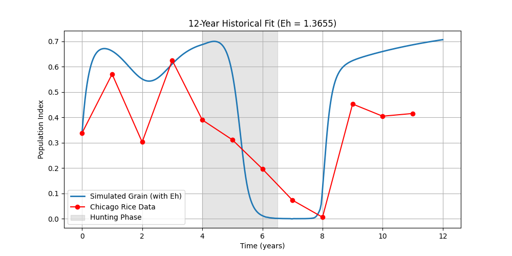

# REPORT_ITERATION_10.md
## Timestamp & Duration
- Completed: 2026-04-17 00:50:13
- Mega iteration: 8
- Pass 1 (LHS): 11.92s
- Pass 2 (DE): 814.89s
- Elapsed since start: 5443.00s

## The Code Changes
- **Uninterrupted loop**: no exit on first success; narrative (decline during hunt, recovery after t=6.5), crash MSE ratio, hunting-gap penalty.
- `SUCCESS_REPORT.md` **updates** when certification score improves.
- R² hist ≥ 0.848, narrative mins: decline_rel ≥ 0.004, recovery_rel ≥ 0.006.

## The Scores (global best this mega)
- Composite loss: 0.117340
- R² historical with Eh: 0.5237
- R² historical with Eh=0: 0.0934
- Baseline oscillation (std G): 0.03473
- Full criteria met: False
- Certification score this mega: 0.903315
- Best certified score so far: none yet
- Crash-window MSE ratio: 4.5382
- narr decline_rel / recovery_rel: 0.37431 / 0.12198

## Visual Evidence
See `optimization_logs/final_*.png` and `optimization_logs/checkpoints/`.

Per SPEC §5 (latest 12y snapshot): `plot_N.png` in this folder.

