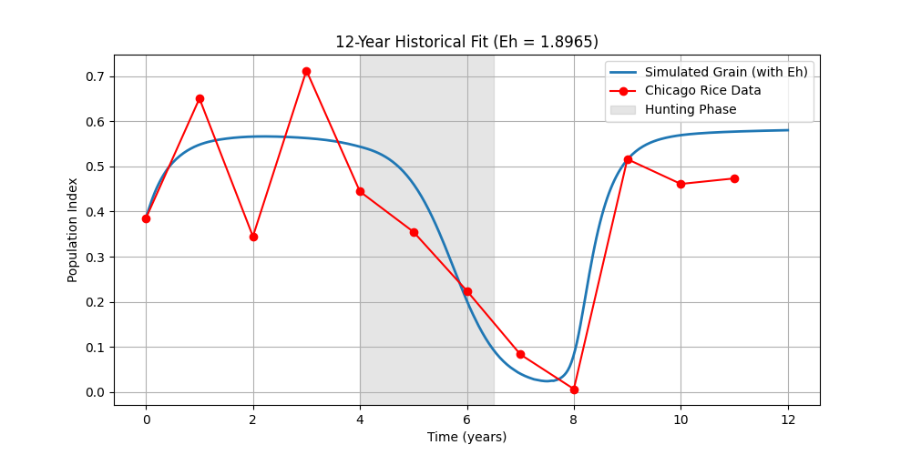

# REPORT_ITERATION_7.md
## Timestamp & Duration
- Completed: 2026-04-17 15:00:22
- Mega iteration: 5
- Pass 1 (LHS): 9.69s
- Pass 2 (DE): 2413.27s
- Elapsed since start: 7106.50s

## The Code Changes
- **Uninterrupted loop**: no exit on first success; narrative (decline during hunt, recovery after t=6.5), crash MSE ratio, hunting-gap penalty.
- `SUCCESS_REPORT.md` **updates** when certification score improves.
- R² hist ≥ 0.862, narrative mins: decline_rel ≥ 0.006, recovery_rel ≥ 0.009.

## The Scores (global best this mega)
- Composite loss: 0.083880
- R² historical with Eh: 0.7100
- R² historical with Eh=0: 0.2727
- Baseline oscillation (std G): 0.08769
- Full criteria met: False
- Certification score this mega: 1.138016
- Best certified score so far: none yet
- Crash-window MSE ratio: 17.1285
- narr decline_rel / recovery_rel: 0.81489 / 3.75538

## Visual Evidence
See `optimization_logs_current/final_*.png` and `optimization_logs_current/checkpoints/`.

Per SPEC §5 (latest 12y snapshot): `plot_N.png` in this folder.

